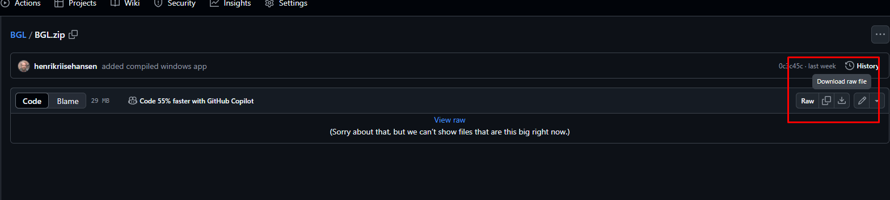

# BGL
Business generated links troubleshooting tool

## Installation

1. Download the latest version of the BGL tool from Github here https://github.com/henrikriisehansen/BGL/blob/main/BGL.zip

2. Install the BGL tool
   

## Encrypt in the payload

1. Copy and paste the Encryption key and Authentication key from the business web app here  https://businessapp.b2b.trustpilot.com/invitations/business-generated-links
to the Encryption key and Authentication key fields.
2. Add the Domain to the Domain field

3. Press the Encrypt button to encrypt

## Decrypt the payload

1. Copy and paste the Encryption key and Authentication key from the business web app here https://businessapp.b2b.trustpilot.com/invitations/business-generated-links
2. Copy and paste the payload to the Payload to decrypt field and press the Decrypt button.

